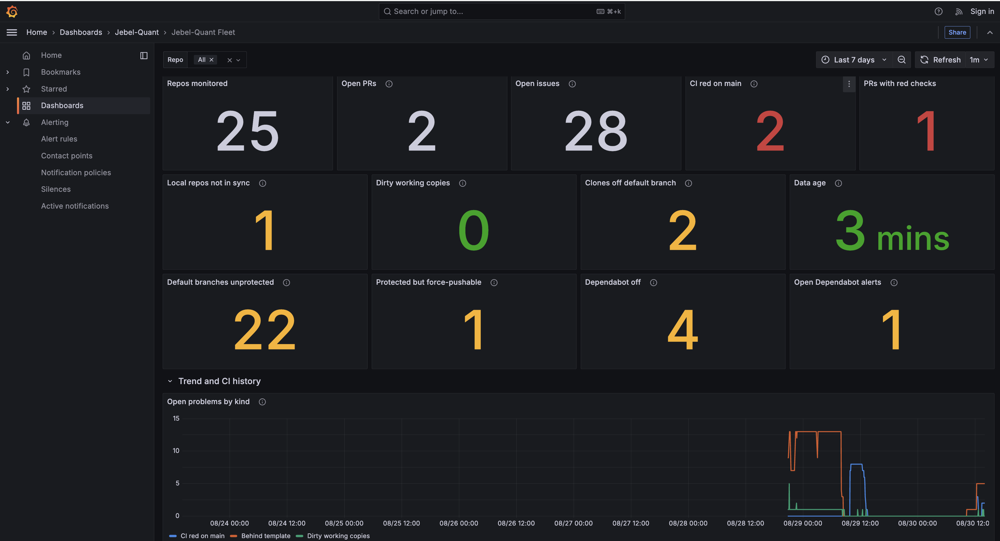

# Fleet monitoring

[](https://github.com/Jebel-Quant/monitoring/actions/workflows/ci.yml)
[](https://github.com/Jebel-Quant/monitoring/actions/workflows/book.yml)
[](https://jebel-quant.github.io/monitoring/)
[](collector/pyproject.toml)
[](LICENSE)

A Grafana board for the state of your repo fleet — template drift, CI on the
default branch, open pull requests, and the working copies on this machine —
with Prometheus keeping the history and six alert rules on top.

One container, one file. Nothing is discovered behind your back: a repo is on
the board because `repos.yml` names it — or names the folder you keep it in —
and for no other reason.



The top tiles are what the forge says about the repos, the next row is what this
machine says about your clones, and every tile that counts something opens the
table of exactly which repos are behind its number — see
[the dashboard tour](docs/dashboard.md).

## Recipe

Write a `repos.yml` — one entry per repo you want on the board, or one
entry for a folder of them:

```yaml
repos:
  - path: ~/repos/jebel-quant/rhiza     # a checkout on this machine
  - folder: ~/repos/cvxgrp              # every checkout in a folder
  - repo: Jebel-Quant/actions           # monitored, but not cloned here
  - repo: acme/platform/infra/web       # GitLab, on the same board
    forge: gitlab
```

`namespace/name` comes from each checkout's `origin`, so the path is all you
write, and the path is used as written — a checkout does not have to live at
`<root>/<owner>/<name>`. **A `folder:` puts every checkout inside it on the
board**, one level deep, which is how an org you keep whole stays one line
instead of twenty — see
[A folder of repos](docs/configuration.md#a-folder-of-repos). **GitHub and GitLab repos share one board**; the forge
is read off the origin's host where there is a checkout, and stated with
`forge: gitlab` where there is not — see
[Configuration](docs/configuration.md#github-and-gitlab-in-the-same-fleet).
Then:

```bash
docker run -d --name jq-fleet \
  -p 127.0.0.1:3000:3000 \
  -v "$PWD/repos.yml:/config/repos.yml:ro" \
  -v "$HOME:/host:ro" \
  -v jq-fleet-data:/data \
  -e GITHUB_TOKEN="$(gh auth token)" \
  ghcr.io/jebel-quant/monitoring:latest

open http://localhost:3000/d/jq-fleet
```

The board fills in within a minute. That is the whole install — the dashboard,
the datasource, the alert rules and the scrape config are in the image, so
there is nothing to clone and nothing on your disk but `repos.yml`.

### The four flags

| | |
|---|---|
| `-v .../repos.yml:/config/repos.yml:ro` | Required. The fleet — [details](docs/configuration.md) |
| `-v "$HOME:/host:ro"` | Your home directory, read-only, so `~/...` in `repos.yml` resolves. Leave it out and the working-copy panels stay empty; everything the forge reports still works |
| `-v jq-fleet-data:/data` | Prometheus history and Grafana's database. Leave it out and both start empty at every run |
| `-e GITHUB_TOKEN=...` | Needs `repo` and `read:org`, and must read every GitHub repo you listed. Without one GitHub allows 60 calls an hour, which is not a fleet |
| `-e GITLAB_TOKEN=...` | Only if the fleet has a GitLab repo in it. Needs `read_api` |

`docker compose up -d` does the same thing with the flags written down; see
[`docker-compose.yml`](docker-compose.yml).

## Then what

| | |
|---|---|
| Add or drop a repo | edit `repos.yml`, `docker restart jq-fleet` — [details](docs/configuration.md) |
| Erase a dropped repo's history | [`docker exec jq-fleet purge-repo owner/name`](docs/configuration.md#dropping-a-repo) (irreversible) |
| Stop | `docker rm -f jq-fleet` (add `docker volume rm jq-fleet-data` to discard the history too) |
| See what it is doing | `docker logs -f jq-fleet` — all three processes, prefixed ([why one container](docs/operations.md#one-container-three-processes)) |
| Edit the board | change `grafana/dashboards/fleet.json` and rebuild — [read the traps first](docs/dashboard.md#traps-worth-not-re-introducing) |
| Get notified | add a contact point under *Alerting → Contact points* — [why it is not provisioned](docs/dashboard.md#alerting) |
| Migrate from the old two-container stack | [carry the Prometheus history over](docs/operations.md#coming-from-the-two-container-stack) |

| | |
|---|---|
| Dashboard | <http://localhost:3000/d/jq-fleet> |
| Alert rules | <http://localhost:3000/alerting/list> |
| Prometheus | <http://localhost:9090> — add `-p 127.0.0.1:9090:9090` |
| Raw metrics | <http://localhost:9109/metrics> — add `-p 127.0.0.1:9109:9109` |

Publish port 3000 to `127.0.0.1` only, as above, because anonymous read access
is on: the board opens without signing in, and `admin` / `admin` is only for
settings. A `0.0.0.0` binding would serve private repo names and pull request
titles to the whole LAN without a password.

## Docs

Also published as a book: **<https://jebel-quant.github.io/monitoring/>**

| | |
|---|---|
| [Configuration](docs/configuration.md) | `repos.yml`, the environment, the API budget |
| [What it watches](docs/metrics.md) | the four subjects, the metrics, and why each is shaped that way |
| [The dashboard](docs/dashboard.md) | reading it, editing it, alerting, and the query traps |
| [Day to day](docs/operations.md) | why panels say *No data*, and what the sign-in button is |

**If every panel says "No data", the machine was probably asleep.** Docker
pauses with it. The *Data age* tile says how stale things are; the next scrape
lands a few seconds after waking. See [docs/operations.md](docs/operations.md).
